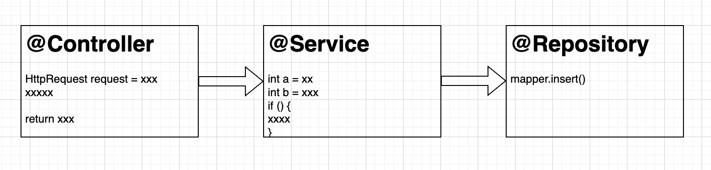
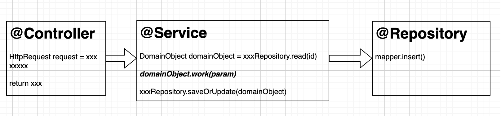
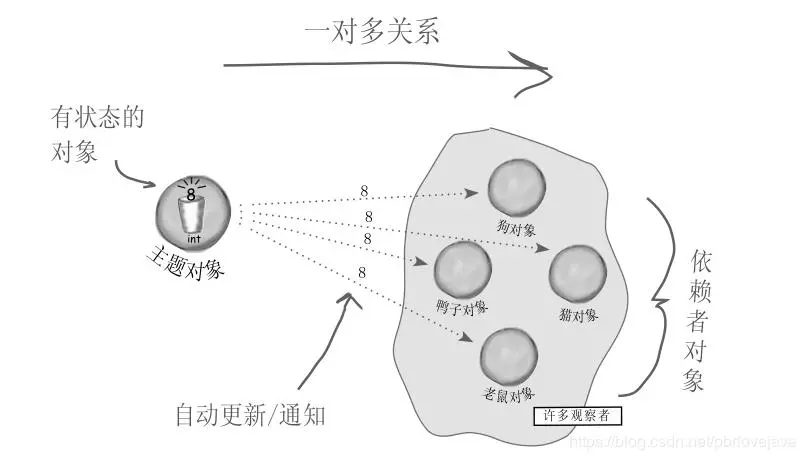

# milky

## 项目基本介绍
本项目定位为一个易用的ddd框架，笔者在朋友的介绍下接触了[Axon](https://www.axoniq.io/)，Axon本身为一个深度拥抱DDD，CQRS的的Java框架，不过研究过程中发现，推荐使用的JPA在国内也没啥人用，其深度封装上手有一定困难，当然还有一些其他原因。我决定自己写一个，开发历时已经近一年。本框架已经应用在两个项目中，线上运行均已经十分稳定，开发体验也相对不错。

## 基本思想
两年前刚开始接触Java时，见到了最常见的代码结构，设计库表结构，构建xml+mapper，然后写service层，最后再搞一个@Controller或者@Dubbo之类的provider。典型三层架构。这应该构成了业务不太复杂业务的主要开发模式，其编程的核心是处理数据库，即用户的请求，最终落地为更改数据库。



其实对于一般的业务这种思路基本够用，Spring本身所提供的@Controller，@Service，@Repository 注解也似乎在暗中鼓励程序员按照这种模式编写相应程序。其实如果我们细细思考这种编程方法，你能意识到，这种编程范式，其实用c语言或者js甚至你用visual basic都可以完成，不需要面向对象的语言，只需要面向过程语言即可。

所谓面向过程就是说，程序的组织结构是一段一段的代码，相互调用，中间用一些变量传递。这是非常之直观的思路，也是高级语言一开始开发的主要模式。但是上世纪80年代，以C++和Java为代表的面向对象语言大行其道，这说明面向对象才是整个计算机界的共识，也就是OPP->OOP的转变。

> OPP Oriented Procedure Programming
> OOP Oriented Object Programming

回头看三层模式的代码，每个Spring Bean所承载的都是一些其他的SpringBean，这并不是面向的对象，所谓面向对象，以下解释节选至维基百科

>Object-oriented programming (OOP) is a programming paradigm based on the concept of "objects", which can contain ***data*** and ***code***. The data is in the form of fields (often known as ***attributes or properties***), and the code is ***in the form of procedures*** (often known as methods).

通过上述表示也可以看出，其本质要求是一份程序中的主要结构应该是一些有成员变量且有实例方法的对象。而此时你再看一份三层结构的代码，你会发现，其实这是典型的面向过程，所有的业务对象只是作为参数传递。

针对以上问题，业界有一种比较流行的基于DDD的解决方法，抽象出一个业务对象，并将一些service层的代码移动到业务对象内部，业务对象的实例方法只能修改自己的成员变量，一些不能移动进去的方法（比如数据库读写）构成一个领域服务层，领域服务层进行领域对象读取，调用相应的业务对象实例方法，并完成持久化。

* 不舒服的第一点

为什么不舒服呢？我的理解是这样的，假设我们有一台理想电脑，内存无限大，且永不宕机，那么就没必要进行持久化了，所有的数据都在内存里面，所以这告诉我们一个道理，持久化并不是一个程序中的业务内容，他只是我们应对不可理想化的电脑采取的主动规避手段，那这就可以推理出另外一个结果，即业务层应该是可以持久化分离开。Milky就实现了这个设计


* 不舒服的第二点

领域服务的定位，对于组织持久层读取和更新和方法调用，解释为领域服务的能力，这让人很不舒服，读书的时候，讲解面向对象原理的时候，经常性会举出一个例子，如果一个Dog对象，应该是Dog对象本身有属性，皮毛颜色，同时Dog对象有方法，比如dog.wangwang()。 那么平移到CS/BS结构中，应该是某个对象接受某个请求，发生了某种行为。所以应该是 dog.listen("jumpCommand") 然后做出相应，这样才实现了完成的面向对象，即一个一个业务对象在接受一个一个请求，做出相应反应


* 不舒服的第三点

有时候领域服务还会做这种事情，某个请求同时要更改两个表里面的，两条关联的记录，DomainService会同时组织对于这两个对象的读取存储以及相应的参数传递，有时候还要加事务。其实这种模式对于迭代很麻烦，因为如果某个变更，需要针对性的对某种特殊情况。特殊的修改第二个对象。这样就开始有if else。另外一种情况时，可能有一些并不在主链路的需求，也会叠加进主链路的代码中，最后一个方法又臭又长。有经验的程序员会及早的应用观察者模式，采用事件传递，修改完第一个对象，发出一个事件，第一个对象并不关心谁消费这个事件，只要写一个观察器，针对性针对某个事件做出相应，这就隔离开了两个对象，如果有什么不在主链路的动作，也可以另外在写一个观察者


***针对以上三点，Milky框架完成了相当舒服的实现***

## Milky demo 分析

福报厂是我开始大量开始写Java的公司，因为在电商业务线。所以也以电商的为例做了一个简单demo。在较大型的电商架构中，商品信息的存储肯定有一个中心化的存储机构，但是这个中心化的存储机构一般是不负责库存的管理的，因为库存管理太过复杂，一般单独一个部分专门负责库存。因为需要处理秒杀，供应链，仓储等一堆乱七八糟的问题。

对于电商系统最基本的一个需求，就是卖家需要将商品信息录入系统。同时需要能修改商品信息，涨涨价，改改图之类的。根据刚才的说法，商品主信息和库存信息应该是分开存储的，且有两个团队维护，那么这里久可以抽象出两个业务对象，商品(Item) 和库存（Inventory），然后我们简单列举需求
> 成员变量

| Item | Inventory |
|------|-----------|
| 商品id | 商品id      |
| 标题   | 仓Code     |
| 库存   | 库存数量      |

> 领域能力（实例方法）

| Item | Inventory |
|------|-----------|
| 创建商品 | 创建库存      |
| 修改标题 | 修改库存      |


现在我们设计好了这两个对象，已经可以开始写程序了

### 领域对象java实现

```Java
public class Item extends AggregateRoot {

    Long itemId;
    String title;
    Long amount;

    @CommandHandler(dependencies = "userInfo")
    public Item(ItemCreateCommand command, Context context) {
        this.itemId = command.getItemId();
        this.title = command.getTitle();
        this.amount = command.getAmount();
        UserInfo userInfo = TypedEnums.userInfo.extractFrom(context.getDependencies());
        context.publish(ItemCreatedEvent.builder().itemId(itemId).title(title).build());
    }

    // the return type context here is only for test the interceptor
    @SneakyThrows
    @CommandHandler
    public Context handle(ItemTitleUpdateCommand command, Context context) {
        String originalTitle = this.title;
        this.title = command.getUpdateTitle();
        ItemTitleUpdatedEvent event = ItemTitleUpdatedEvent.builder()
                .itemId(itemId).originalTitle(originalTitle).updatedTitle(title).build();
        context.getMetaData().put(TypedEnums.markHandle, Clock.currentTimeMillis());
        Thread.sleep(10L);
        context.publish(event);
        return context;
    }
}
```
以上代码清晰地表明了一个业务对象具有的属性和领域能力，即可以接受创建一个商品的请求，或者更新一个商品标题请求，而对象本身拥有id，标题，库存数量这三个属性，而且相应的核心业务代码里面是没有从数据库读入或者从存储数据库动作，以下为库存对象的相应属性和能力，结构类似。

```java
public class Inventory extends AggregateRoot {

    private Long itemId;
    private Long amount;
    @Override
    public String getAggregateId() {
        return itemId.toString();
    }

    @CommandHandler
    public Inventory(InventoryCreateCommand command, Context context) {
        this.itemId = command.getItemId();
        this.amount = command.getInitAmount();
        InventoryCreatedEvent event = InventoryCreatedEvent.builder()
                .itemId(itemId).initAmount(amount)
                .build();
        context.publish(event);
    }

    @CommandHandler
    public void handleInventoryUpdateCommand(InventoryUpdateCommand command, Context context) {
        Long originalAmount = this.amount;
        this.amount = command.getUpdateAmount();
        InventoryUpdateEvent event = InventoryUpdateEvent.builder().itemId(itemId)
                .originalAmount(originalAmount).updateAmount(amount).build();
        context.publish(event);
    }

}
```

Milky要求所有业务对象继承至AggregateRoot对象，并实现一个聚合根对象方法，一般情况下直接返回id.toString()即可，要求同一个类型的对象不能重复即可

### 持久化实现

当然数据肯定还是要持久化的，与前面设计思路类似。Milky的数据库的读取与更新由框架完成，只需要针对相应对象实现对应接口，如下代码范例

```Java
public class ItemDAOAdapter implements AggregateDaoAdapter<Item> {

    @Override
    public Item toAggregate(@NonNull Object dataObject) {
        ItemDO itemDO = (ItemDO) dataObject;
        return Convertor.INST.to(itemDO);
    }

    @Override
    public Object toDataObject(Item item, DataObjectInfo dataObjectInfo) {
        return Convertor.INST.to(item);
    }

    @Override
    public DataObjectInfo dataObjectInfo(String aggregateId) {
        Long primaryId = Long.parseLong(aggregateId);
        return DataObjectInfo.builder().clazz(ItemDO.class).primaryId(primaryId).build();
    }

    @Mapper(unmappedTargetPolicy = ReportingPolicy.IGNORE,
            nullValuePropertyMappingStrategy = NullValuePropertyMappingStrategy.IGNORE)
    public interface Convertor {

        Convertor INST = Mappers.getMapper(Convertor.class);

        @BeanMapping(builder = @Builder(disableBuilder = true))
        Item to(ItemDO itemDO);

        @BeanMapping(builder = @Builder(disableBuilder = true))
        ItemDO to(Item item);

    }

}
```

Milky抽象出了一个DataObject的概念，其实就是一般数据库的Orm对象，XXDO之类，DO对象的持久化是另外一层，如下代码。一般这里是真实发生数据库存储的地方，你也许会有疑问为什么不能将这两层融合，其实这里这么设计的主要原因是，某类领域对象在持久化的时候可以根据类型不同，持久化不同的数据库记录，比如一个手机存储的数据库记录，包含丰富的手机信息，比如材质，品牌，3G/4G/5G，一件衣服的数据库记录不会存储这些手机的属性，但是会有一些共有的信息，比如品牌，价格，折扣。那么当我们处理业务对象只需要品牌，价格，折扣这个三个信息时，这两条数据库记录都会经过DaoAdapter变成我们需要的领域对象（业务对象）。但是持久化时，需要转换为相应数据库orm对象，再进行存储

这里面其实隐藏了一个很麻烦的问题，对于一个已经在数据库的手机存储记录，假设我们只需要更新其价格，那么业务对象只有价格这个信息，当领域对象反向转换为数据库对象时，其他品牌之类的属性肯定是null, 一般的思路是使用update selective的方式，即更新不为null的字段，其实update selective的方法也有问题，如果某个字段就是改为null，这样反而无法更新，为了这个麻烦的问题，milky采用了一种极为方便的方式，禁止数据库字段为null，如果真要要表示某个字段的业务属性为空或者没有，可以选择 -1， “ ”（空串）之类的方法，而且本身milky不依赖数据库的updateSelective之类的方法，而是采用了merge的方案，即把内存中更新的updateDataObject对象 与数据库的对象发生merge，而且此处利用null值的的特性，即如果updatedDataObject某个字段为null，那么以数据库为准，如果数据库本身对象就是null，那说明这是一个新建对象，直接用update对象。这玩意就是merge的基本描述，说心里话，如果写起来还是挺复杂的，Milky巧妙的应用了mapperStruct的代码生成完成了这个代码自动生成，具体详细可以看ItemDAOWrapper内部的Merger类实现

```java
public class ItemDAOWrapper implements DAOWrapper<ItemDO, Long> {

    final ItemDOMapper itemDOMapper;

    @Override
    public int batchSave(@NonNull List<ItemDO> itemDOs) {
        return itemDOs.stream().map(itemDOMapper::insert).reduce(0, Integer::sum);
    }

    @Override
    public int batchUpdate(@NonNull List<ItemDO> itemDOs) {
        return itemDOs.stream().map(itemDOMapper::updateById).reduce(0, Integer::sum);
    }

    @Override
    public Map<Long, ItemDO> batchGetByPrimaryIds(@NonNull Set<Long> itemIds) {
        List<ItemDO> itemDOs = itemDOMapper.selectBatchIds(itemIds);
        return Collect.toMap(itemDOs, ItemDO::getItemId);
    }

    @Override
    public ItemDO merge(@NonNull ItemDO priority, @NonNull ItemDO general) {
        return Merger.INST.merge(priority, general);
    }

    @Mapper(unmappedTargetPolicy = ReportingPolicy.IGNORE,
            nullValuePropertyMappingStrategy = NullValuePropertyMappingStrategy.IGNORE)
    public interface Merger {

        Merger INST = Mappers.getMapper(Merger.class);

        @BeanMapping(builder = @Builder(disableBuilder = true))
        ItemDO merge(ItemDO priority, @MappingTarget ItemDO general);

    }
}
```

### 观察者模式
观察者模式是一种很典型的非常好用的设计模式，它所强调的是，通过事件交互，减少耦合，A发出事件，B观察这个事件，但是A并不关心B是否消费这个事件，或者有多少人消费这个事件。



回到上述的例子，因为商品的领域对象和库存的领域对象是分开的，所以商品发布的消息，应该触发了库存的对象生成，这种中间商品这个对象并不关心谁消费这个事件。作为用户只需要写一个EventRouter来路由这种事件，如下代码，事件路由器路由商品创建事件，进而驱动一个创建库存的command，然后这个命令直接送上命令总线，那么就直接执行了库存的领域能力
```java
@RequiredArgsConstructor
public class EventRoutersForItem implements EventRouters {

    final MqService mqService;

    @EventRouter
    public void inventory(ItemCreatedEvent event, Context context) {
        InventoryCreateCommand command = InventoryCreateCommand.builder()
                .itemId(event.getItemId()).initAmount(100L).build();
        CommandBus.driveByEvent(command, event);
    }

    @FinalEventRouter
    public void mqCreated(List<ItemCreatedEvent> events, Context context) {
        events.forEach(event -> {
            ItemCreatedMessage message = ItemCreatedMessage.builder().itemId(event.getItemId()).title(event.getTitle()).build();
            mqService.sendMessage(message);
        });
    }

}
```

上述代码还有一个@FinalEventRouter
这是Milky一个特殊的设计，因为对于普通@EventRouter，当事件发生以后直接路由即可，有些特殊的路由，可能要等这个一整个请求完成再发生路由，比如对外发消息。回到本文的例子，商品创建之后，会继续创建库存，系统消息商品创建之后和库存创建之后都要对外发生一条mq，那么如果商品创建之后，立即发消息，即普通的EventRouter，如果创建库存失败了，那么消息已经发出去了，而创建商品的数据库记录因为库存创建失败而发生回滚了，这样就发生了一致性问题。所以设计了这种@FinalEventRouter，避免这种问题。消息最后统一发送，同时@FinalEventRouter还可以设置Order，且Order不能设置为0，这里事关一些内存事务的问题。后文介绍.

### 内存事务
TODO

## Milky 示例
笔者做电商出身

引入方式
```xml
<dependency>
    <groupId>com.stellariver.milky</groupId>
    <artifactId>milky-spring-boot-starter</artifactId>
    <version>latest</version>
</dependency>
```

            
提供bom文件
```xml
<dependency>
    <groupId>com.stellariver.milky</groupId>
    <artifactId>milky-dependencies</artifactId>
    <version>latest</version>
    <type>pom</type>
    <scope>import</scope>
</dependency>
```
详细使用方式请看demo模块及相应测试
电脑本身有jdk，和maven的情况下，且JAVA_HOME环境变量，PATH环境变量内包含jdk及maven地址情况下
```shell
mvn clean test
```
即可

本项目还支持了maven wrapper 
所以在有JAVA_HOME的情况下
```shell
.\mvnw clean test
```
